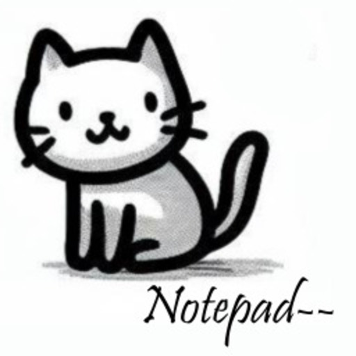
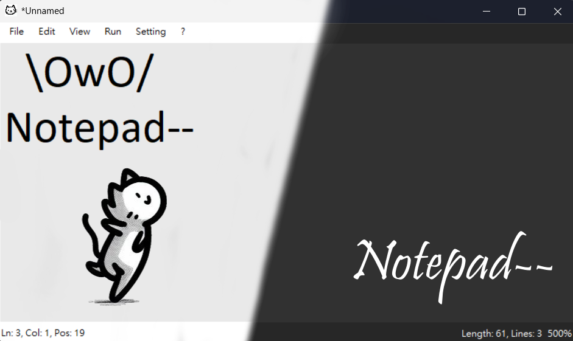

</img>

## About
Notepad-- is an free open-source notepad application based on notepad++ (WIP)
[**Full Changelog**](Changelog.md)
> [!NOTE]
> This project are still very WIP, if you find any issues/questions/suggestions feel free to ask in [Issues](https://github.com/johnny263/notepad-minus-minus/issues) or [Discussions](https://github.com/johnny263/notepad-minus-minus/discussions)

## Owner
[@syesjohnny](https://github.com/syesjohnny) [@yt6983138](https://github.com/yt6983138)

## Collaborator
[@syesjohnny](https://github.com/syesjohnny)
[@yt6983138](https://github.com/yt6983138) 

## Contributing
### Suggestions and bug reports
Really easy, think great suggestions or report bugs.
If we think you are a high active or have many great suggestions, you reward Galaxy Brain/Bugs Catcher!

### Code
Ask us in Discord for code contributing, our review is very strict because you are a stranger to us.
If we think you are a really nice programmer, you reward Computer Brain!
We recommend using Visual Studio as the code editor.

### Translations
Not support now

[More Details](CONTRIBUTING.md)
## Contact
If you have any questions, suggestions, or just want to say hello, feel free to reach out to us at our [Discord](https://discord.gg/GNcq8sabBt).

## License
Notepad-- is licensed under the terms of the [CC0-1.0 license](https://github.com/johnny263/Notepad-minus-minus/blob/master/LICENSE).
